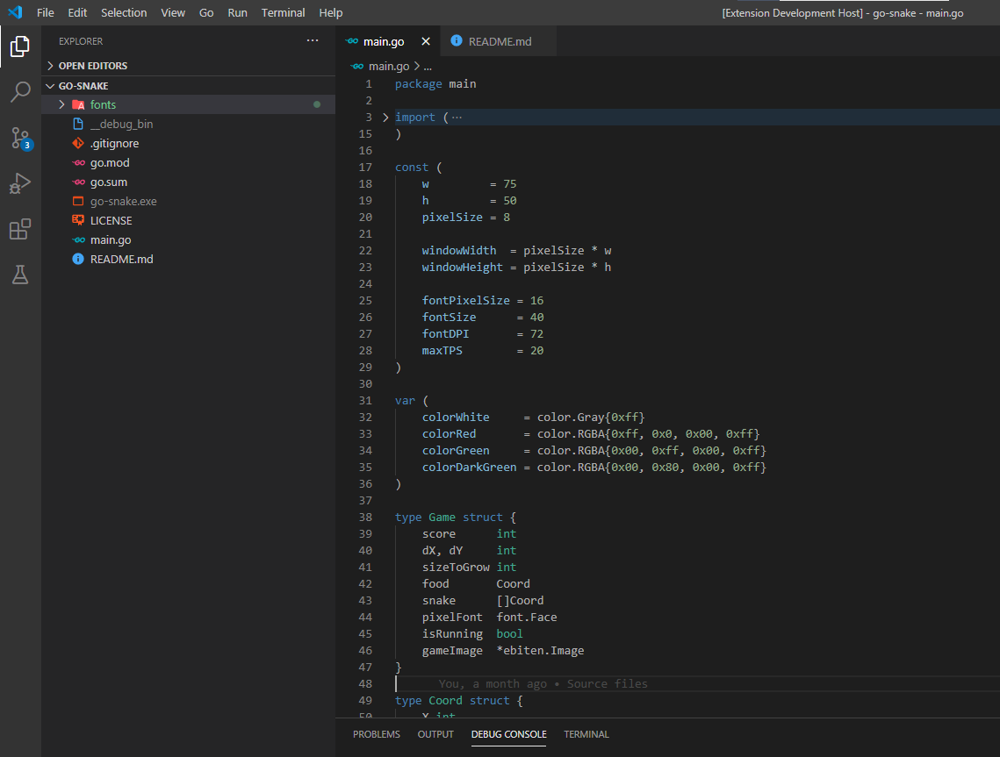
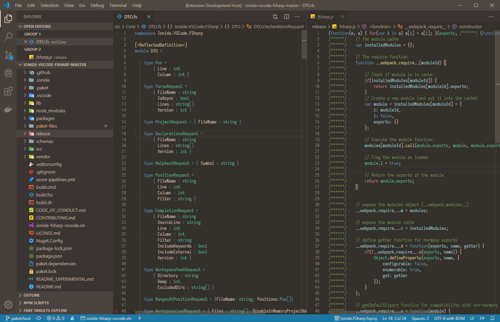
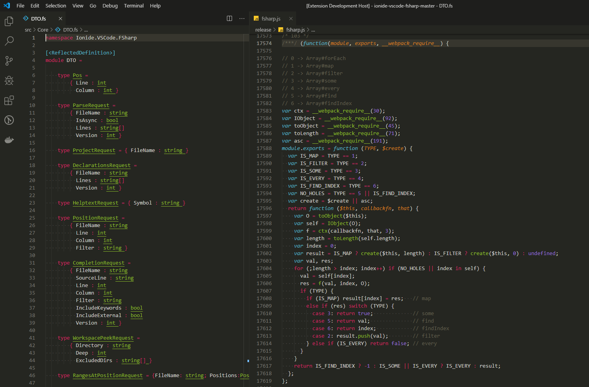
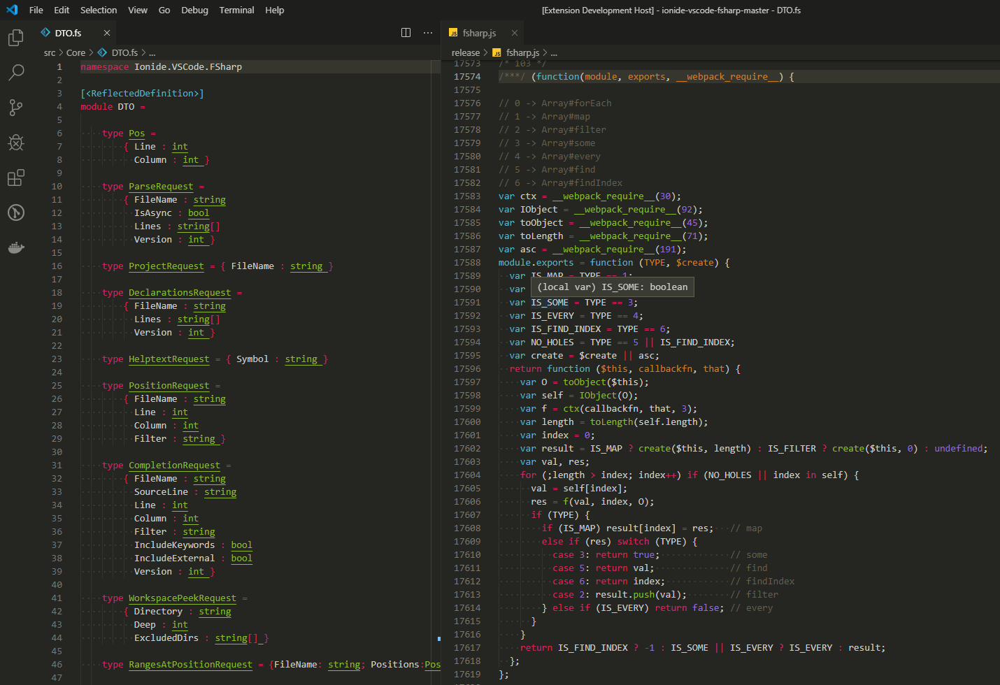

# Dark themes with lowered contrast

Themes based on VS Code built in themes, but with lowered contrast & some minor visual fixes

## Install

press `ctl/command + p` to launch the command palette then run

```bash
ext install dark-low-contrast
```

## Screenshots

### Dark Low Contrast



### Dark Low Contrast Warm



### Monokai Low Contrast



### Monokai Low Contrast No Italic



## Change log

You can take a look at the change log [here](https://github.com/evgeniyp/vscode-dark-low-contrast/blob/master/CHANGELOG.md)
