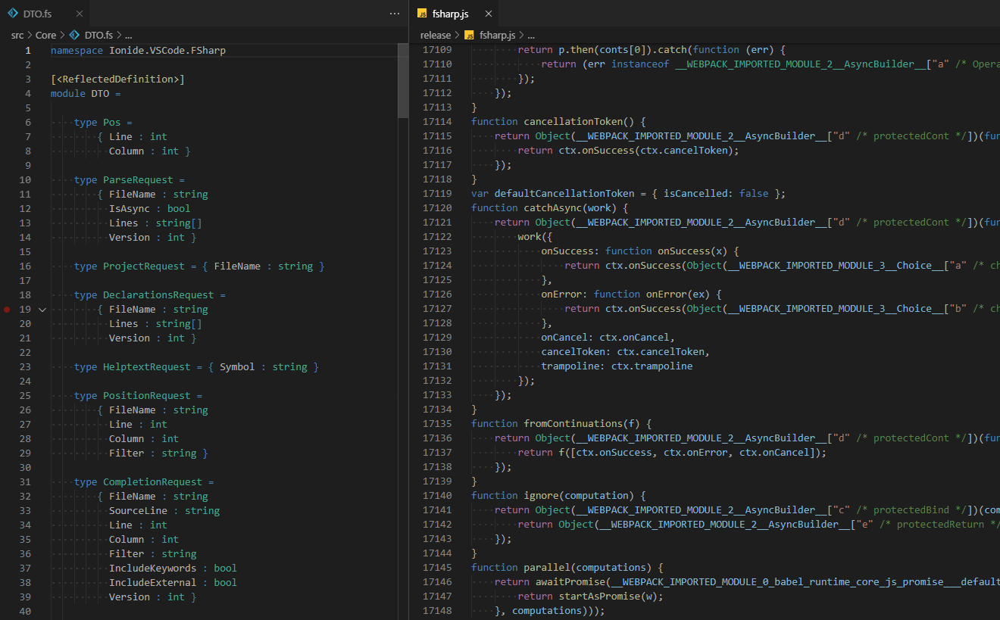

# Dark+ theme with lowered contrast

Theme based on Dark+ but lowered contrast & some minor visual fixes

## Install

press `ctl/command + p` to launch the command palette then run

```bash
ext install dark-low-contrast
```

## Screenshot

Screenshot of F# and JavaScript



## Change log

You can take a look at the change log [here](https://github.com/evgeniyp/vscode-dark-low-contrast/blob/master/CHANGELOG.md)
